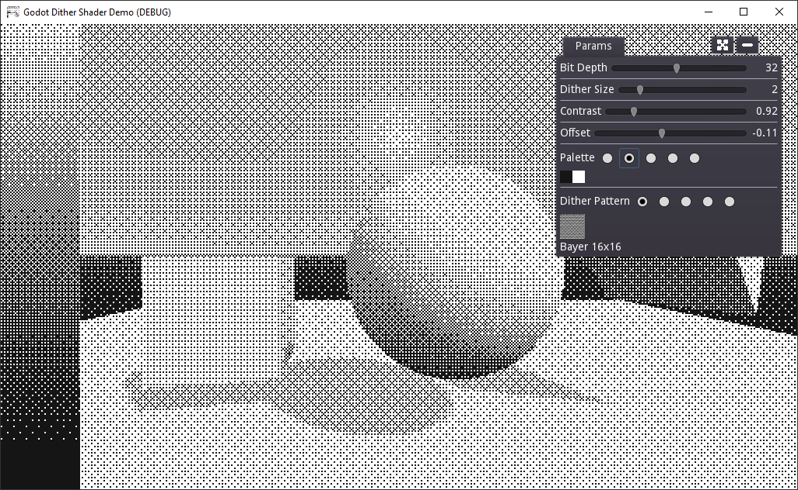

# Godot Dither Shader

This is a dither shader inspired by Lucas Pope's Return of the Obra Dinn.

If you're only interested in the [shader code, click here](https://github.com/samuelbigos/godot_dither_shader/blob/master/shader/dither.shader).

The rest of this repo is a demo of the dither shader applied to a simple scene in Godot, with a few debug options, palettes and dither patterns to experiment with.

## How to use

The shader itself is a simple post-process screen shader which is most easily applied using a combination of a Viewport and ViewportContainer (see the demo).

You'll need to setup the material with correct uniforms:

### Textures

* **u_dither_tex** - This is the texture that's used to create the dither pattern. It is most commonly a bayer matrix (8x8 or 16x16) but could technically be anything. **Make sure your import settings are correct**, it needs to tile (Repeat enabled) and have no filtering. The dither textures supplied in the demo are by [tromero](https://github.com/tromero/BayerMatrix) (MIT licensed).
* **u_color_tex** - This is the palette used to determine which colours to dither between. It can contain as many colours as you'd like, but the more colours, the less of an effect the dither has. The texture can be any size, as long as the colours change linearly along the X axis (ideally darkest on the left). [Lospec is a great source of palettes](https://lospec.com/palette-list).

### Parameters

* **u_bit_depth** - If you'd like a more banded appearance, lower this value.
* **u_contrast** - Adjusts luminance scale around the mid-point, linearly. Increasing contrast will darken shadows and brighten highlights.
* **u_offset** - Shifts luminance up or down, allowing you to tweak how dark or light the output is.
* **u_dither_size** - Adjust size of each dither pixel. Increase for a more pixelated look.

## Implementation

I plan to write a blog post here detailing the implementation. Otherwise, [dither.shader](https://github.com/samuelbigos/godot_dither_shader/blob/master/shader/dither.shader) is fairly well commented if you're interested in how it works.

## Improvements

At the moment, the dither pattern is statically mapped to screen space, which meaans when objects or the camera moves, the dither pattern will stick to screen space and not world space. Lucas Pope details his efforts to correct this on a devlog [here](https://forums.tigsource.com/index.php?topic=40832.msg1363742#msg1363742). I would like to give this a go at some point, because I think it would significantly improve the quality of the effect.

## Links and References

* Lucas Pope's devlog for Return of the Obra Dinn - https://forums.tigsource.com/index.php?topic=40832.msg1363742#msg1363742
* Initial implementation reference - https://danielilett.com/2020-02-26-tut3-9-obra-dithering/
* Bayer matrix textures - https://github.com/tromero/BayerMatrix
* Blue noise texture - http://momentsingraphics.de/BlueNoise.html
* Used in Geiger, a game I made for Mini Jam 76 - https://sambigos.itch.io/geiger
* Follow me on Twitter - https://twitter.com/Calneon

## Changelog

### v1.0: Initial release for Godot 3.2.3 (should work fine with other versions)

- Initial release.
